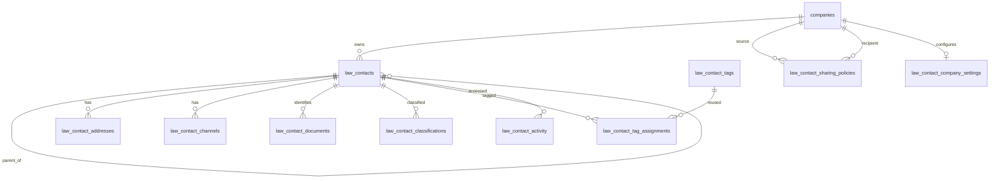

# Modelo de dados da Gestão de Contatos Law

## Propriedade e relações

A empresa (`company_id`) é dona dos cadastros. `law_unit_id` legado é mantido
por compatibilidade, mas novos registros usam `NULL`: setores internos
autorizados veem a base da empresa. `record_kind` diferencia contato e unidade;
`legal_nature` diferencia PF e PJ e é nulo para unidade. `parent_contact_id`
forma uma hierarquia na mesma empresa, com um pai por filho e vários filhos por
pai. Contexto, classificações e tags ficam em estruturas separadas.

## Tabelas

### `law_contacts`

Cadastro principal existente, ampliado com:

| Campo | Regra |
| --- | --- |
| `legal_nature` | `pf` ou `pj`, padrão `pf`; indexado com empresa e status. |
| `record_kind` | `contact` para pessoa PF/PJ ou organização PJ; `unit` para unidade autônoma, cuja `legal_nature` é nula. |
| `parent_contact_id` | Pai imediato opcional com FK composta por empresa; PF não pode ser pai nem filho. |
| `sharing_excluded` | Booleano que retira individualmente o contato das regras externas. |
| `display_name`, `legal_name` | Nome principal e razão social/nome complementar; valores normalizados no servidor. |
| `status`, `deleted_at`, `merged_into_id` | Controlam ciclo de vida. Exclusão lógica usa `status=excluido` e `deleted_at`; mesclagem preserva o destino. |
| `law_unit_id` | Nulo para os novos registros de propriedade empresarial compartilhada. |

### `law_contact_addresses`

Até dois endereços completos por contato. Inclui tipo, CEP, logradouro,
número, complemento, bairro, município, UF, país e indicação de principal.
Tipos: residencial, comercial, correspondência e outro. Composto
`(company_id, law_contact_id)` referencia o cadastro de mesma empresa.

### `law_contact_channels`

Telefones e e-mails do contato ou unidade. `channel_type` aceita `phone`/`email`;
`label` descreve o canal e `is_personal` marca separadamente o dado sensível.
`is_primary`/`sort_order` apoiam exibição. O limite por registro é quatro
telefones e dois e-mails. Canais pessoais são protegidos por permissão e não
são compartilhados.

### `law_contact_documents`

Até quatro documentos por contato. `document_number_encrypted` guarda o valor
com `Crypt`; `document_fingerprint` guarda HMAC do CPF/CNPJ normalizado com
unicidade por empresa para detecção de duplicados sem índice sobre o texto aberto. Tipo, rótulo e UF
emissora completam o registro. CPF/CNPJ são opcionais e validados quando
fornecidos. CPF pertence a PF; CNPJ e inscrição estadual pertencem a PJ.
Inscrição estadual usa o tipo `state_registration` e exige UF emissora.

### `law_contact_departments`

Tabela legada preservada para reversibilidade da migração. Cada departamento
existente é promovido a um registro `law_contacts` do tipo `unit`; o campo
`migrated_contact_id` aponta para esse registro e mantém a correspondência com a
linha histórica. Novos registros hierárquicos não são gravados como departamento.

### Classificação e tags

- `law_contact_classifications` associa códigos do vocabulário controlado por
  empresa/contato e marca uma classificação principal (`is_primary`); as demais
  são secundárias. `requires_review` preserva e sinaliza códigos legados sem
  correspondência no catálogo atual. A PK impede repetição.
- `law_contact_tags` contém nome e nome normalizado únicos por empresa.
- `law_contact_tag_assignments` associa até seis tags a cada contato sem
  duplicar associações.

Vocabulário de classificações: `lawyer`, `law_firm`, `private_company`,
`financial_institution`, `educational_institution`,
`civil_society_organization`, `professional_entity`, `notary_office`,
`public_body`, `police`, `prosecutor_office`, `public_defender`,
`other_organization`, `expert`, `witness`, `representative`, `party` e
`other`. `client` e `court_unit` são valores legados preservados e marcados
para revisão. `public_body` identifica somente órgão público; empresas,
bancos, escolas e outras organizações recebem sua categoria própria. Unidade
judiciária é tipo institucional, com dados e código CNJ próprios.

Categorias como parte, testemunha e perito são referências cadastrais. Não são
papéis de atuação contextual. Papéis como cliente, servidor, colaborador e
usuário do serviço ficam na relação PF–organização e não produzem registros
transacionais ou financeiros.

### `law_contact_company_settings`

Uma linha por empresa armazena `segment_code` e `context_code` ativos e o último
administrador que alterou a configuração. A troca de contexto muda rótulos e
sugestões da interface, mas não converte, apaga ou recria contatos e vínculos.

### `law_contact_activity`

Registra empresa, contato, usuário, ação e horário para os itens recentes do
dashboard pessoal. Tipos incluem criação, edição, abertura normal e abertura
de resultado de busca. O termo digitado na busca não é persistido.

### `law_contact_sharing_policies`

Regra de saída entre `source_company_id` e `recipient_company_id`, única por
par de empresas. O compartilhamento exige políticas ativas nos dois sentidos:
cada empresa configura e pode revogar o próprio lado do acordo. `legal_natures`
define PF/PJ e `profession_names` limita as pessoas físicas às profissões
selecionadas e vinculadas a contatos da origem. `shared_fields` define os
campos adicionais expostos. `is_active` permite revogação sem apagar auditoria.
O compartilhamento fica desativado por padrão e só vale enquanto ambas as
assinaturas incluírem o componente Contatos.

Campos compartilháveis: `professional_channels`, `business_addresses` e
`documents`. A API remove canais pessoais, endereços residenciais, notas,
tags e metadados internos; documentos também dependem de permissão sensível no
destino. A referência compartilhada é somente leitura, não é copiada à empresa
destinatária e não consome sua capacidade.

## Capacidade e índices

Consumo = registros sem exclusão lógica/mesclagem, incluindo unidades. A
exclusão lógica reduz o consumo. A contagem é feita no servidor
durante a transação de criação/edição e validada contra o snapshot comercial da
assinatura. Índices mantêm busca por empresa/natureza/status, escopo de canais,
documento fingerprint, tags normalizadas, classificações e atividade recente.

## Segurança e integridade

- Tabelas filhas carregam `company_id` e FKs compostas ao contato para impedir
  referência cruzada entre empresas.
- APIs sempre escopam por empresa ativa e aplicam assinatura e permissões.
- Dados sensíveis são omitidos ou mascarados sem `law.contacts.sensitive.view`;
  alterações comuns preservam os valores sensíveis não exibidos.
- Mesclagem transfere registros filhos dentro de transação, combina
  classificações/tags sem duplicatas, registra motivo e marca origem como
  mesclada.
- Todas as ações administrativas e alterações relevantes geram auditoria.

## Compatibilidade e rollout

A migração `2026_10_01_000100_add_context_and_hierarchy_to_law_contacts.php`
promove departamentos existentes a unidades independentes e preserva as linhas
legadas com `migrated_contact_id`. Os canais acompanham a unidade promovida.
Também cria configuração contextual por empresa, marcadores de classificação
principal e avisos para códigos legados sem correspondência. Na reversão,
unidades existentes são mantidas como organizações PJ para não apagar dados
criados após a migração.

## Evolução do vínculo pessoa–empresa e dados institucionais

`law_contact_relationship_roles` guarda vários papéis padronizados por vínculo,
com complemento para Outro e início/término próprios. A vigência é calculada
pelas datas e não concede permissões. `law_contact_relationship_designations`
guarda cargos, postos, graduações ou funções em períodos independentes; uma
relação pode ter várias designações vigentes. Os nomes livres ficam disponíveis
como sugestões reutilizáveis pela empresa. Relações antigas continuam válidas
sem inventar papéis ou designações.

`law_contact_institutional_data` guarda blocos opcionais; `is_primary` marca o
tipo institucional principal e permite tipos secundários. Para unidade
judiciária, armazena código CNJ e competências; para órgão público, esfera
Federal/Estadual/Distrital/Municipal e código oficial com sistema emissor.
Identificadores são opcionais e sua ausência gera aviso de completude, sem
bloquear o cadastro.
A sigla do contato segue representando tribunal/região. OAB continua em
`law_contact_documents`, sem campo duplicado.

## Qualidade e sugestões de duplicidade

Indicadores consideram apenas contatos próprios ativos. Correspondências por
e-mail/telefone profissional ou código institucional podem ser sugeridas;
similaridade de nome apenas reforça um candidato já corroborado. A resposta
expõe motivo, nunca o valor coincidente. A análise é sob demanda e paginada;
não bloqueia gravação nem mescla automaticamente. CPF/CNPJ permanece sujeito à
validação rígida existente.
